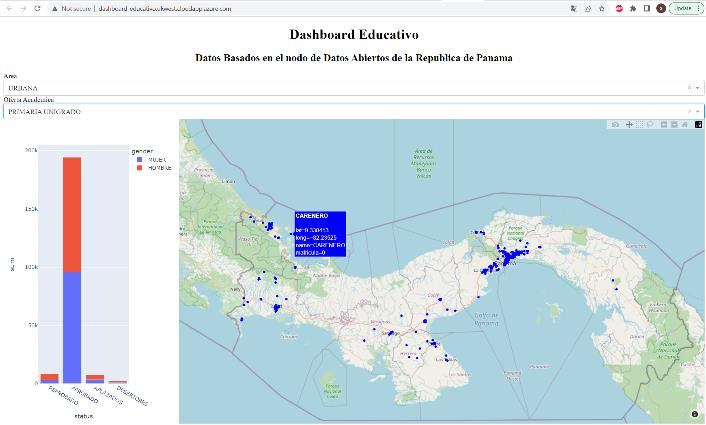
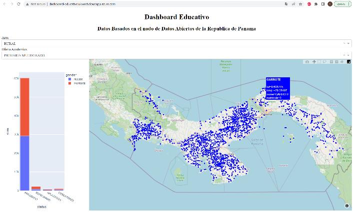
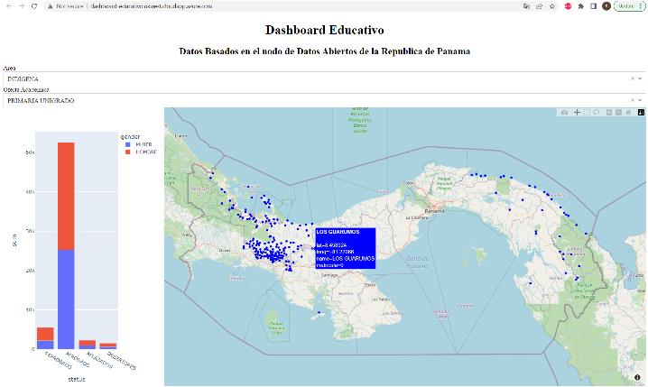

# Observatorio de datos educativos Geo-referenciados

## Resumen del Proyecto

Este proyecto se basa en un sistema que mediante la lectura de
archivos CSV y manejo de datos utilizando Geopandas, Shapefiles
PostGIS y DB Postgres muestra el comportamiento de las tendencias
del desempeño de los estudiantes con respecto al tiempo. Luego
creamos un script en Python para generar páginas html y en ellas un
Dashboard donde se muestran las gráficas de la información ordenada
en función de tiempo, ya sea años, cantidad de meses y gestión de
turno. Todo montado en la nube en un servidor de Azure.

## DESCRIPCION DEL PROYECTO
Para solucionar el problema se realizaron las siguientes acciones:

1. Obtuvimos los datos proporcionados por el MEDUCA
(Ministerio de Educación) en formato Excel de las
estadísticas de todos los colegios de la republica de panamá
por año electivo 2019 y 2020.

2. Procesamos los datos y se limpian para facilitar su
manipulación en el lenguaje de programación Python.

3. Creamos una base de datos en Postgres SQL donde
introducimos los datos obtenidos del MEDUCA,
modificándolos para facilidad de uso. La modificación
principal fue referenciar los puntos de coordenadas de cada
una de las escuelas (o almenos un punto en común, por
corregimiento) a los puntos en el mapa que se mostrará en
el dashboard final

4. Una vez creada la base de datos, la montamos online
utilizando el servicio de nube de Microsoft Azure, lugar
donde accederemos de ahora en adelante sin realizar
ninguna modificación adicional.

5. Utilizando la librería de Python Geopandas en dataiku se
presentará un mapa de Panamá al cual se le pueden realizar
consultas de: cantidad de estudiantes aprobados, cantidad
de estudiantes reprobados, cantidad de estudiantes
desertores y cantidad de estudiantes aplazados. Todas estas
consultas tendrán como parámetros: el tiempo(trimestre,
año, meses, etc.), provincia, corregimiento, escuela y grado

## Tecnologias empleadas

Para el proyecto se va a utilizar principalmente Python y un poco de
consultas SQL para el manejo de la base de datos.
- ### Psycopg2: 
  - Es un adaptar de la base de datos PostgreSQL
  para el lenguaje de programación de Python. Permite la
  conexión con la base de datos de Heroku.
- ### Descartes: 
  - Permite el uso de objetos geométricos como
  matplotlib.
- ### Pandas: 
  - Es una biblioteca de software escrita como
  extensión de NumPy para manipulación y análisis de datos
  para el lenguaje de programación Python. En particular,
  ofrece estructuras de datos y operaciones para manipular
  tablas numéricas y series temporales.
- ### Dash: 
  - Es un framework de Python creado por Plotly, se
  utiliza para crear aplicaciones web interactivas.
- ### Postgres SQL: 
  - Es un sistema de gestión de bases de datos
  relacional orientado a objetos y de código abierto,
- ### Plotly: 
  - Es una biblioteca de gráficos y gráficos en Python
  similar a Matplotlib.

## Descripcion del Proyecto
### Funcionamiento:
- #### Introducimos los inputs Area y Oferta académica respectivamente:
  - URBANA, PRIMARIA UNIGRADO.
  
  

  - Ahora cambiamos a RURAL, MULTIGRADO
  
  

  - Ahora colocamos INDIGENA, UNIGRADO
  
  

## CONCLUSIONES

- La implementación de los sistemas de información son el futuro para
la toma de decisiones en nuestro país. Esto quiere decir que es muy
importante la integridad y seguridad de los datos que se obtienen
cuando se abstraen del mundo real. Al ver los resultados de este
proyecto nos damos cuenta que es necesario realizar ajustes en el
sistema educativo para solventar las necesidades de la cantidad de
estudiantes reprobados, aplazados y desertores.

#### Las dificultades encontradas fueron:
- La instalación de PostGres nos produjo una perdida de horas ya que
no podíamos conectarnos a servidor de postgres por un conflicto de
conexión fallida. Lo pudimos resolver implementando postgres como
un servicio que brinda Azure al momento de levantar la máquina
virtual.
- La implementación de PostGIS también fue un reto, tuvimos que
buscar documentación online para saber como convertir los puntos
coordenados que estábamos utilizando a un punto en el mapa. El
profesor también tenía documentación sobre esta implementación en
las clases sobre postgis.

## REFERENCIAS
Sitios Web Consultados
- [1] Postgis.net. 2022. 18. Geography — Introduction to PostGIS. [online] Available
at: <http://postgis.net/workshops/postgis-intro/geography.html> [Accessed 21
July 2022].
- [2] MEDUCA. 2022. Estadisticas. [online] Available at:
<https://www.meduca.gob.pa/direccion-plane/estadisticas> [Accessed 21 July
2022].
- [3] GitHub. 2022. blog/Install-Python-Dash-App-on-Ubuntu-Server.md at master ·
fox000002/blog. [online] Available at:
<https://github.com/fox000002/blog/blob/master/Install-Python-Dash-App-onUbuntu-Server.md> [Accessed 21 July 2022].
- [4] Dash.plotly.com. 2022. Deploy your Dash App | Dash for Python Documentation
| Plotly. [online] Available at: <https://dash.plotly.com/deployment> [Accessed
21 July 2022].
- [5] Pythonprogramming.net. 2022. Python Programming Tutorials. [online]
Available at: <https://pythonprogramming.net/deploy-vps-dash-datavisualization/> [Accessed 21 July 2022].